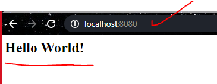
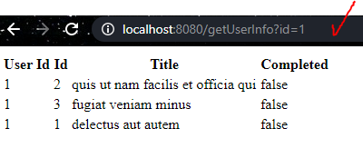
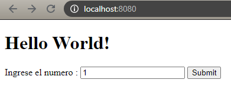

# Ciclos de vida y desarrollo de Software

### Parte II - HACIENDO UNA APLICACION WEB DINAMICA DE BAJO NIVEL

### Creamos el proyecto maven


#### El puerto TCP/IP para el servidor Tomcat esta configurado en el puerto :8080

### Compilamos y ejectuamos la aplicacion en el servidor Tomcat usando el siguiente comando

```
mvn package 
mvn tomcat7:run
```

En caso de obtener algun error con el inicio del servidor " No plugin found for prefix 'tocmat7' in the current project and in the plugin groups [org.apache.maven.plugins, org.codehaus.mojo] available from the repositories"
usar el siguiente comando:
```
mvn clean install tomcat7:run
```
Debemos obtener el siguiente mensaje:


Una vez nuestro servidor este funcionando, nos iremos a nuestro navegador de 
preferencia y entraremos en la direccion ip: localhost:8080


Y si entramos en nuestra direccion sobre la cual haremos las peticiones "/helloServlet"
veremos el saludo desde nuestra peticion


Ahora jugaremos con los parametros de nuestro GET para ello agregaremos a nuestra
url el valor "/helloServlet?name= Johann y Juan" y obtenremos el sigueinte resultado


### Creando un nuevo servicio 

Una vez creemos nuestro nuevo servicio de tipo GET realizamos las pruebas correspondientes

- El servidor responde de manera correcta y devuelve contenido



- No se indican parametros


- El parametro no es un entero


- Ell valor ingresado no existe


### PARTE III
 Primero , creamos el archivo Html y luego  desplegamos el servidor para ver como se ve:

 
 
 - Probamos  el Post

 
 
- Probamos que el GET funcione correctamente


#### ¿Que diferencia hay entre el metodo GET y POST?
Si utilizamos el metodo GET el input debe llamarse igual  que el parametro que estamos recibiendo
Mientras que el POST  no recibe parametros ni tampoco devuelve nada al formulario.  

#### ¿Que esta viendo en la clase Service?
Cuando utilizamos el metodo GET , la clase service.java nos permite hacer un llamado a una URL en la cual nos retorna una Lista de las cosas por hacer en formato json y el mismo metodo se encarga de convertir los datos  a un Objeto; en este caso se llamado TodoServices, y esta misma clase se encarga de renderizar los elementos en un ambiente HTML utilizando tablas.

### PARTE IV -Pruebas
### A
Primero intentamos adivinar el numero y proporciona los siguientes resultados:
#### Perder Intento

#### Ganar Juego

#### Perder Juego


### Diferencias entre ApplicationScope y SessionScope
Encontramos que al ejecutar en Application Scope se generan valores iguales para todos los usuarios, por lo tanto se genera un sistema "online" que permite a todos los usuarios dentro de la aplicacion, modificar los valores y ver los cambios. Por el contrario con SessionScope, alcanzamos unicamente a cada usuario, asi que cada aplicacion se ejecuta
independientemente.

### Jugando con el estilo
Encontramos el elemento que genera el numero aleatorio, y lo que hacemos es cambiarle su propiedad de display:"none" a display:"block" para poderlo visualizar en pantalla

